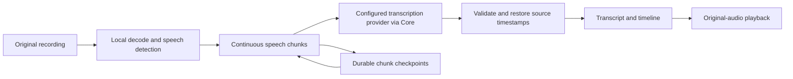

# Riffado Long Audio

**Resume long transcriptions. Jump from words to the original recording.**

An independent, self-hosted fork of [Riffado](https://github.com/riffado/riffado), focused on long meetings, lectures, and interviews. Local speech detection and durable processing jobs extend the original transcription workspace.

[](LICENSE)
[](https://github.com/JeremyL691/riffado/actions/workflows/ci.yml)
[](https://github.com/riffado/riffado/tree/v0.6.4)

[Get started](#get-started) · [What changed](#what-changed) · [Processing guide](docs/audio-pipeline.md) · [Validation](docs/validation.md) · [Upstream](https://github.com/riffado/riffado)

## Why this fork

Long recordings benefit from more than a larger upload limit. Processing should survive an interruption, preserve the original audio clock, and make the finished transcript useful for review.

- **Process speech, skip long silences.** Silero VAD runs locally. Short pauses remain in the audio, and chunks prefer natural pauses near two minutes.
- **Continue after interruptions.** Jobs, VAD checkpoints, and completed chunk results persist on disk. Failed chunks can be retried without discarding successful work.
- **Listen from the transcript.** Click a timestamped segment to seek the original recording. The current segment is highlighted during playback.
- **Keep timing honest.** Native provider timestamps are validated and restored to the source recording clock. Missing or invalid timestamps produce a saved transcript with `needs_alignment`, rather than estimated positions.
- **Take the timeline with you.** Full-data archives include a versioned `timeline.json` with segment timing, timestamp provenance, and processing configuration.

## What changed

This branch builds on upstream **v0.6.4**. Later upstream changes are not automatically included. The comparison below describes the additions to that baseline, rather than claiming that upstream cannot process long recordings.

| Area | Inherited from Riffado | Added by this fork |
| --- | --- | --- |
| Recordings | Plaud sync, original audio storage and playback | Local VAD and continuous, non-overlapping speech chunks |
| Transcription | User-configured providers and browser Whisper | Durable server jobs with chunk-level persistence and retries |
| Playback | Recording player and transcript views | Click-to-seek segments and active-segment highlighting |
| Progress | Existing transcription controls | Processing phases, progress, cancellation, retry, and disk-space pause/recovery |
| Timing | Provider-dependent transcription output | Structured absolute timestamps with strict validation |
| Export | Transcript formats and full-data archives | `timeline.json` alongside the transcript and processing metadata |

Plaud connection, summaries, title generation, local/S3 storage, encrypted Core data, and automation APIs come from the original project. Browser transcription continues to use its existing path.

## How it works



The private Python service handles preprocessing and checkpoint state. Riffado Core owns storage access and AI credentials, makes provider requests, and encrypts the persisted transcript and timeline. The service is reachable only inside the Compose network.

## Get started

Requirements: Docker with Compose, a Plaud account, and a server transcription provider configured in Riffado. The bundled preprocessing model runs locally; speech recognition runs at the provider you select.

```sh
git clone --branch enhanced https://github.com/JeremyL691/riffado.git
cd riffado
cp .env.example .env
```

Edit `.env` and set these values. Generate a different random value for each secret using `openssl rand -hex 32`:

| Variable | Value |
| --- | --- |
| `POSTGRES_PASSWORD` | A random hex password |
| `BETTER_AUTH_SECRET` | A separate random secret |
| `ENCRYPTION_KEY` | A separate 64-character hex key |
| `AUDIO_PIPELINE_TOKEN` | A separate random secret, at least 32 characters |
| `APP_URL` | `http://localhost:3000` for a local installation |

Build and start the enhanced stack:

```sh
docker compose -f docker-compose.yml -f docker-compose.enhanced.yml up -d --build
```

Open [localhost:3000/register](http://localhost:3000/register), create an account, connect Plaud, and select a server transcription provider in settings. Start a transcription from the dashboard to use the pipeline.

The enhanced Compose overlay builds this fork locally and enables preprocessing. The upstream one-line installer and upstream published images install the original project and do not include these enhancements. No prebuilt enhanced image is published by this repository yet.

For storage, job controls, provider behavior, and upgrades, see the [processing guide](docs/audio-pipeline.md).

## Scope and current limits

- The pipeline is for self-hosted server transcription. Hosted mode and browser transcription use the original paths.
- The implementation accepts recordings up to 24 hours. That is an enforced limit, not a claim of a completed 24-hour endurance test.
- Playback positioning requires valid segment timestamps from the configured model. Gemini and chat-style transcription currently save text without a timeline.
- The default service budget is one recording job, two concurrent STT requests, two CPUs, and 2 GiB of RAM. Decoded 24-hour PCM needs about 2.76 GB of disk space, plus the source audio and temporary files.
- The fork has not established comparative accuracy, latency, or provider-cost benchmarks. VAD and chunking add their own processing overhead.
- Later upstream features, including ElevenLabs integration and subsequent fixes, need an explicit integration effort. Do not point a database migrated by later upstream versions at this older fork schema.

## Development and validation

```sh
pnpm install --frozen-lockfile
pnpm format-and-lint
pnpm type-check
pnpm test

cd audio-pipeline
uv run --frozen --group dev ruff check src tests
uv run --frozen --group dev ruff format --check src tests
uv run --frozen --group dev pytest
```

Python 3.12 is used for the pipeline. See [validation scope](docs/validation.md) for the checks performed and the external checks that remain unverified.

Automated regression tests and synthetic fixtures are part of the source. Personal recordings, real credentials, local databases, environments, caches, and processing workspaces are excluded. Keep your `.env` private.

## Documentation and support

- [Audio preprocessing and deployment](docs/audio-pipeline.md)
- [Local validation and limitations](docs/validation.md)
- [Original Riffado documentation](https://riffado.com/docs)
- [Report a fork-specific issue](https://github.com/JeremyL691/riffado/issues)
- [Original project and contributors](https://github.com/riffado/riffado)

## License and acknowledgments

AGPL-3.0. See [LICENSE](LICENSE). This fork retains the original project's license and history. The bundled Silero VAD model includes its [upstream license](audio-pipeline/models/SILERO_LICENSE.txt).

Riffado was originally created by **Perier** and is maintained by the Riffado community. The Riffado name and banner identify the upstream project. Long-audio enhancements are maintained independently in this fork.

Riffado and this fork are independent of Plaud Inc. and are not endorsed by Plaud. Device and service names are used to describe interoperability.
